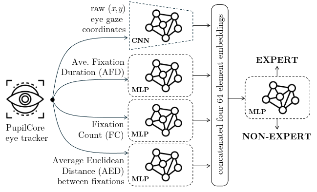
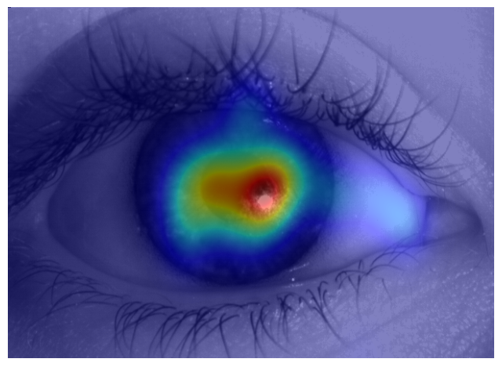

# AutoSIGHT: Automatic Eye Tracking-based System for Immediate Grading of Human experTise

Official repository for IEEE Vision Languages and Human Centric Computing (VL/HCC 2025) paper: **IEEEXplore | [ArXiv](https://arxiv.org/abs/2508.01015)**

## AutoSIGHT Architecture Overview

<p align="center">
  
</p>

## Abstract
> Can we teach machines to assess the expertise of humans solving visual tasks automatically based on eye tracking features? This paper proposes AutoSIGHT, Automatic System for Immediate Grading of Human experTise, that classifies expert and non-expert performers, and builds upon an ensemble of features extracted from eye tracking data while the performers were solving a visual task. Results on the task of iris Presentation Attack Detection (PAD) used for this study show that with a small evaluation window of just 5 seconds, AutoSIGHT achieves an average average Area Under the ROC curve performance of 0.751 in subject-disjoint train-test regime, indicating that such detection is viable. Furthermore, when a larger evaluation window of up to 30 seconds is available, the Area Under the ROC curve (AUROC) increases to 0.8306, indicating the model is effectively leveraging more information at a cost of slightly delayed decisions. This work opens new areas of research on how to incorporate the automatic weighing of human and machine expertise into human-AI pairing setups, which need to react dynamically to nonstationary expertise distribution between the human and AI players (e.g. when the experts need to be replaced, or the task at hand changes rapidly). Along with this paper, we offer the eye tracking data used in this study collected from 6 experts and 53 non-experts solving iris PAD visual task.

## Dataset Overview
#### Summary
* Each Participant's data will contain:
    * Master file of gaze locations for the experiment
    * Eye Gaze Heatmaps for each image the participant evaluated
    * Gaze sequence files for 5, 10, 15, 20, and 30 second window sizes
    * A list of JSON objects with detailed data on a per-image basis

#### Requesting a Copy of the Dataset
Instructions on how to obtain a copy of the dataset can be found at the [Notre Dame's Computer Vision Research Lab webpage](https://cvrl.nd.edu/projects/data) (search for AutoSIGHT dataset). Any questions can be directed to Adam Czajka at aczajka@nd.edu.

#### Detailed
The data set is organized on a per-participant basis where each participant has a collection of sequence files for different window sizes and a list of JSON objects which reflect statistics for each image shown to the participant in that study. A summary of what each JSON object contains is shown and explained below:

* Participant's identifier and expertise level
* Link to the original dataset image
* Link to `Eye Gaze Heatmap` file
* Ground truth label of the image sample
* `Inital` and `Final` answers given by participant
* `List of Fixation Times`
* `Fixation Count` for entire evaluation
* `Average Fixation Duration` (MS) for entire evaluation
* The final 5 lists contain references to sequence files such as:
    * If `sequences_5_Second` contains [1,2,3], this means that in the `5_Second` folder for this partipant, the csv files `sequence_1`, `sequence_2`, and `sequence_3` contain information for this image.
    * The same logic applies for the other window sizes
<br>

#### Example JSON Object
```json  
    {
        "participant": "2024-136-068",
        "biometricStatus": "Expert",
        "batch": 14,
        "slideNumber": "1",
        "irisImageLink": "77_05052d288.png",
        "heatmapFilename": "E_068_77_05052d288_Heatmap.png",
        "attackType": "Real Iris",
        "initial": "Normal",
        "final": "Normal",
        "fixationTimes": [],
        "GRI": 0.802,
        "fixationCount": 157,
        "averageFixationDuration": 125.88,
        "sequences_5_Second": [],
        "sequences_10_Second": [],
        "sequences_15_Second": [],
        "sequences_20_Second": [],
        "sequences_30_Second": []
    }
```

#### Heatmap Example
<p align="left">
  
</p>


## Citation
```
@inproceedings{dowling2025autosight,
  title        = {AutoSIGHT: Automatic Eye Tracking-based System for Immediate Grading of Human experTise},
  author       = {Dowling, Byron and Probcin, Jozef and Czajka, Adam},
  booktitle    = {Proceedings of the IEEE Symposium on Visual Languages and Human-Centric Computing (VL/HCC)},
  year         = {2025},
  pages        = {1--8},
  publisher    = {IEEE},
  address      = {7-10 October 2025, Raleigh, North Carolina, United States},
}
```

## Acknowledgments

This work was supported by the U.S. Department of Defense (Contract No. W52P1J-20-9-3009). Any opinions, findings, and conclusions or recommendations expressed in this material are those of the authors and do not necessarily reflect the views of the U.S. Department of Defense or the U.S. Government. The U.S. Government is authorized to reproduce and distribute reprints for Government purposes, notwithstanding any copyright notation here on
